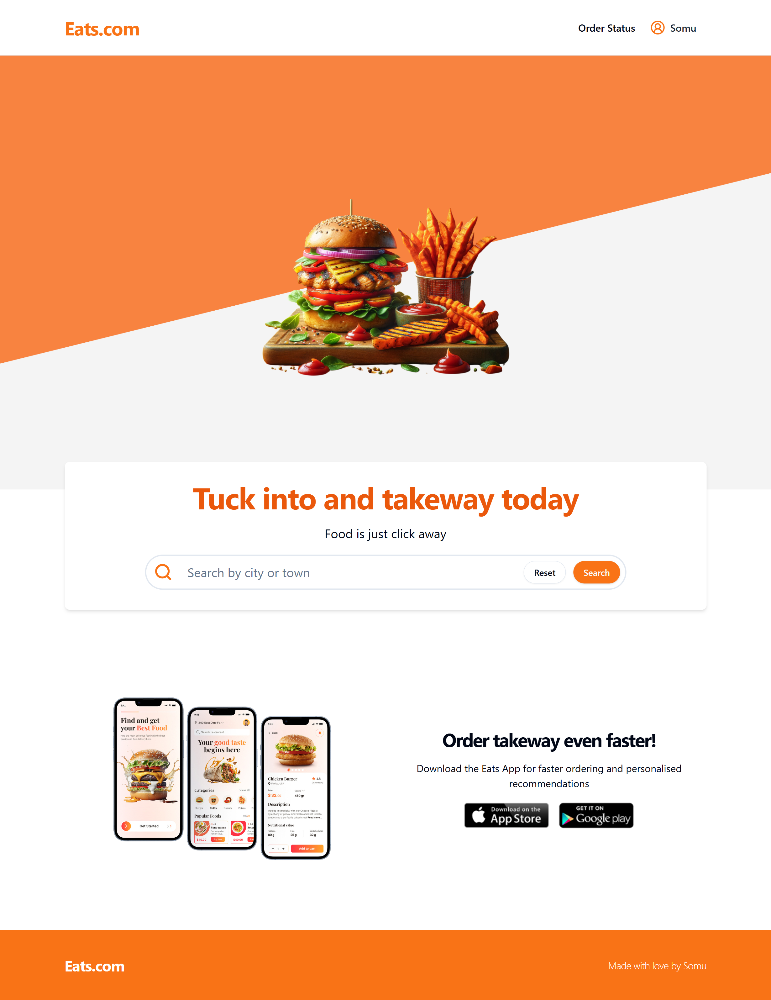
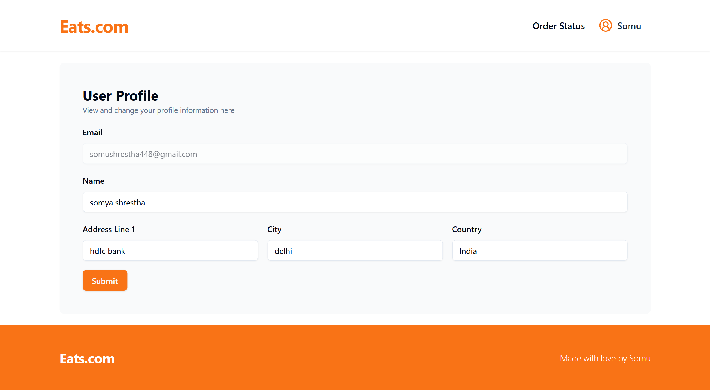

## **Eats.com**

---

code : https://github.com/shalshcode08/Food-Ordering-Application

live : https://food-ordering-frontend-oyv8.onrender.com/ ([https://food-ordering-frontend-oyv8.onrender.com](https://food-ordering-frontend-oyv8.onrender.com/))

---

The Project is end to end Full Stack Food-Ordering Platform made in MERN stack, using typescript for type safety.

**Technologies :** 

Backend: Node.js, Express, MongoDB 

Frontend: React, Shadcn UI, TailwindCSS

Deployment: Render

Authentication and Authorization: Auth0

Payment Gateway: Stripe

Validation: Zod

Image Management: Cloudinary

---

**Images :** 

Landing Page 

User Profile Page 

Manage Restaurant Page

Manage Restaurant

.png)

Orders

.png)

Order Status Page

.png)

Search Results Page

.png)

Restaurant Page

.png)